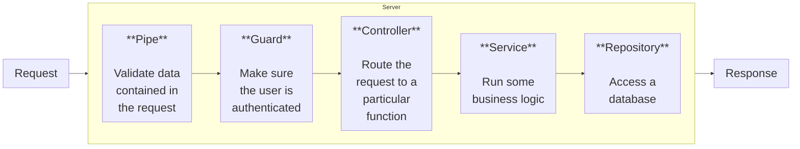

# NestJS Course

## Table of Content

1. [Nest from Scratch](#nest-from-scratch)
2. [With Nest CLI](#with-nest-cli)
3. [Validating data with ValidationPipe](#validating-data-with-validationpipe)
4. [Services and Repositories](#services-and-repositories)

---

## Nest from Scratch

### Initialize project and install dependencies

```bash
npm init -y
npm install @nestjs/common@7.6.17 @nestjs/core@7.6.17 @nestjs/platform-express@7.6.17 reflect-metadata@0.1.13 typescript@4.3.2
```

| Library                      | Description                                                                                           |
| ---------------------------- | ----------------------------------------------------------------------------------------------------- |
| **@nestjs/common**           | Contains vast majority of functions, classes, etc, that we need from Nest                             |
| **@nestjs/core**             | The core runtime of NestJS that powers dependency injection, module loading, and lifecycle management |
| **@nestjs/platform-express** | Lets Nest use Express JS for handling HTTP requests                                                   |
| **reflect-metadata**         | Helps make decorators work. Tons more on this in just a minute!                                       |
| **typescript**               | We write Nest apps with Typescript.                                                                   |

### Initialize typescript - (tsconfig.json)

```json
{
  "compilerOptions": {
    "module": "commonjs",
    "target": "es2017",
    "experimentalDecorators": true,
    "emitDecoratorMetadata": true
  }
}
```

| Setting                        | Description                                                                                                                                                      |
| ------------------------------ | ---------------------------------------------------------------------------------------------------------------------------------------------------------------- |
| "experimentalDecorators": true | Enables the use of decorators (@Something) in TypeScript. Without this, NestJS decorators (like @Controller()) would throw errors.                               |
| "emitDecoratorMetadata": true  | Works together with the reflect-metadata library. Emits extra type information about classes and methods at runtime, which NestJS uses for dependency injection. |

### Common pattern in server



### NestJS provides More

| Part             | Description                                                 |
| :--------------- | :---------------------------------------------------------- |
| **Pipes**        | Validates incoming data                                     |
| **Guards**       | Handles authentication                                      |
| **Controllers**  | Handles incoming requests                                   |
| **Services**     | Handles data access and business logic                      |
| **Repositories** | Handles data stored in a DB                                 |
| **Modules**      | Groups together code                                        |
| **Filters**      | Handles errors that occur during request handling           |
| **Interceptors** | Adds extra logic to incoming requests or outgoing responses |

### We need at least module and controller

### Create (`src/main.ts`)

```ts
import { Controller, Module, Get } from "@nestjs/common";
import { NestFactory } from "@nestjs/core";

@Controller()
class AppController {
  @Get()
  getRootRoute() {
    return "hi there!";
  }
}

@Module({
  controllers: [AppController],
})
class AppModule {}

async function bootstrap() {
  const app = await NestFactory.create(AppModule);
  await app.listen(3000);
}

bootstrap();
```

### Run

```bash
npx ts-node-dev src\main.ts
```

- Should give `Nest application successfully started`

### Check at `localhost:3000`

---

---

### Refactoring

## File Structure

- **main.ts**

  - `function bootstrap`

- **app.controller.ts**

  - `class AppController {}`

- **app.module.ts**
  - `class AppModule {}`

### Conventions

- One class per file (some exceptions)
- Class names should include the kind of thing we are creating
- Name of class and name of file should always match up
- Filename template: `name.type_of_thing.ts`

### Create `app.controller.ts`

```ts
import { Controller, Get } from "@nestjs/common";

@Controller()
export class AppController {
  @Get()
  getRootRoute() {
    return "hi there!";
  }
}
```

### Create `app.module.ts`

```ts
import { Module } from "@nestjs/common";
import { AppController } from "./app.controller";

@Module({
  controllers: [AppController],
})
export class AppModule {}
```

### Update `app.controller.ts`

```ts
import { NestFactory } from "@nestjs/core";
import { AppModule } from "./app.module";

async function bootstrap() {
  const app = await NestFactory.create(AppModule);

  await app.listen(3000);
}
bootstrap();
```

### Adding more Routes

### Update `app.controller.ts`

```ts
import { Controller, Get } from "@nestjs/common";

@Controller("/app")
export class AppController {
  @Get("/hi")
  getRootRoute() {
    return "hi there!";
  }

  @Get("/bye")
  getByeThere() {
    return "bye there!";
  }
}
```

---

---

---

## With Nest CLI

### Install nest cli

```bash
npm i -g @nestjs/cli
```

### Create nest project (message)

```bash
nest new project_name
```

### Run the project

```bash
npm run start:dev
```

### Delete everything in src folder except main

### Generate messages module

```bash
nest generate module messages
```

### Use message module in main (Remove app module)

```ts
import { NestFactory } from "@nestjs/core";
import { MessagesModule } from "./messages/messages.module";

async function bootstrap() {
  const app = await NestFactory.create(MessagesModule);
  await app.listen(3000);
}
bootstrap();
```

### Generate Controller inside messages folder

```bash
nest generate controller messages/messages --flat
```

- `--flat` says dont create folder called controllers

### Update src/messages/messages.controller.ts

```ts
import { Controller, Get, Post } from "@nestjs/common";

@Controller("messages")
export class MessagesController {
  @Get()
  listMessages() {}

  @Post()
  createMessage() {}

  @Get("/:id")
  getMessage() {}
}
```

> **Test using Postman or Thunder Client (vscode extension) for success status code**

### Access Body and Params

- Update src/messages/messages.controller.ts

```ts
import { Controller, Get, Post, Body, Param } from "@nestjs/common";

@Controller("messages")
export class MessagesController {
  @Get()
  listMessages() {}

  @Post()
  createMessage(@Body() body: any) {
    console.log(body);
  }

  @Get("/:id")
  getMessage(@Param("id") id: string) {
    console.log(id);
  }
}
```

> **Test for console log**

---

---

---

## Validating data with ValidationPipe

- Install required packages for validation

```bash
npm install class-validator class-transformer
```

- Update src/main.ts
  - import ValidationPipe
  - use validation pipe globally in all routes
  - validation will run for only those routes with validation rules

```diff
import { NestFactory } from '@nestjs/core';
+ import { ValidationPipe } from '@nestjs/common';
import { MessagesModule } from './messages/messages.module';

async function bootstrap() {
   const app = await NestFactory.create(MessagesModule);
+  app.useGlobalPipes(new ValidationPipe());
   await app.listen(3000);
}
bootstrap();
```

### Create class describing properties of request body

- also called **Data Transfer Object (DTO)**
- create **src/messages/dtos/create-message.dto.ts**

```ts
export class CreateMessageDto {
  content: string;
}
```

### Add validation rules

- applied whenever instance of this dto is created
- update **src/messages/dtos/create-message.dto.ts**

```diff
+ import { IsString } from 'class-validator';

export class CreateMessageDto {
+  @IsString()
   content: string;
}
```

### Apply Validation in Controller route handler

> How just adding dto type works?
>
> > When ts compiles to js. Type information is lost but
> > Because of emitDecoratorMetadata in tsconfig, some of type information is also converted into javascript

- **Update src/messages/messages.controller.ts**

```diff
import { Controller, Get, Post, Body, Param } from '@nestjs/common';
+ import { CreateMessageDto } from './dtos/create-message.dto';

@Controller('messages')
export class MessagesController {
  @Get()
  listMessages() {}

  @Post()
+  createMessage(@Body() body: CreateMessageDto) {
    console.log(body);
  }

  @Get('/:id')
  getMessage(@Param('id') id: string) {
    console.log(id);
  }
}
```

### What is happening

- class-transformer converts json body into instance of dto class
- class-validator is used to validate the dto instance
- if validation error occurs, respond with error 400

## Services and Repositories

- **Services:**
  - handles business logic
  - uses one or more Repositories
- **Repositories:**
  - handles storage-related logic
  - ends up being TypeORM, Mongoose Schema

> Services and Repositories end up having similar method names

### Create Message Repository

- `src/messages/messages.repository.ts`

```ts
import { readFile, writeFile } from "fs/promises";

export class MessagesRepository {
  async findOne(id: string) {
    const contents = await readFile("messages.json", "utf8");
    const messages = JSON.parse(contents);

    return messages[id];
  }

  async findAll() {
    const contents = await readFile("messages.json", "utf8");
    const messages = JSON.parse(contents);

    return messages;
  }

  async create(content: string) {
    const contents = await readFile("messages.json", "utf8");
    const messages = JSON.parse(contents);

    const id = Math.floor(Math.random() * 999);

    messages[id] = { id, content };

    await writeFile("messages.json", JSON.stringify(messages));
  }
}
```

### Create Message Service

- `src/messages/messages.service.ts`

```ts
import { MessagesRepository } from "./messages.repository";

export class MessagesService {
  messagesRepo: MessagesRepository;

  constructor() {
    // Service is creating its own dependencies
    // DONT DO THIS ON REAL APPS
    // USE DEPENDENCY INJECTION
    this.messagesRepo = new MessagesRepository();
  }

  findOne(id: string) {
    return this.messagesRepo.findOne(id);
  }

  findAll() {
    return this.messagesRepo.findAll();
  }

  create(content: string) {
    return this.messagesRepo.create(content);
  }
}
```

### Update Message Controller

- `src\messages\messages.controller.ts`

```diff
import {
  Controller,
  Get,
  Post,
  Body,
  Param,
+  NotFoundException,
} from "@nestjs/common";
import { CreateMessageDto } from "./dtos/create-message.dto";
+ import { MessagesService } from "./messages.service";

@Controller("messages")
export class MessagesController {
+  messagesService: MessagesService;

+  constructor() {
+    // DONT DO THIS ON REAL APP
+    // USE DEPENDENCY INJECTION
+    this.messagesService = new MessagesService();
+  }

  @Get()
  listMessages() {
+    return this.messagesService.findAll();
  }

  @Post()
  createMessage(@Body() body: CreateMessageDto) {
+    return this.messagesService.create(body.content);
  }

  @Get("/:id")
+  async getMessage(@Param("id") id: string) {
+    const message = await this.messagesService.findOne(id);
+
+    if (!message) {
+      throw new NotFoundException("message not found");
+    }
+
+    return message;
+  }
}
```

### Create messages file

- In root folder, create `messages.json` with empty json object

```json
{}
```

> Test using Postman or Thunder Client (vscode extension) for success Create and Read.

### Inversion of Control Principle

- Classes should not create instances of its dependency on its own to make code more reuseable
- Bad: Create dependency instance in constructor
- Better: Pass dependency instance to constructor (just passing IoC Principle and ready to use dependency injection provided by NestJs)
- Best: Pass dependency interface to constructor
  - Now you can pass file db Repo, in memory test db Repo, anything that implements repo inteface
  - But while following this pattern, to create message controller
  - 1. we have to create first create repository
  - 2. then we have to create service and pass repository to service
  - 3. then we have to create controller and pass service to controller
  - 4. if there are multiple repository and services then we are fucked up writing 20 lines for creating instances

### Nest Dependency Injection Container

- This container registers all classes and its dependency and creates a list of it
- When we create controller, it checks the type of parameter of consturctor (MessageService in this case) and creates the message service instance for us recursively. this means it looks at the dependency list and create repository instance then service instance and then return controller instance for us.
- Container will hold onto created dependency instances and reuse them if needed
- Use **@Injectable** decorator to mark a class for registration
- **providers**: Things that can be used as dependencies for other classes

### Refactoring

### With Better way

#### Update Message Repository

- `src/messages/messages.repository.ts`

```ts
import { Injectable } from "@nestjs/common";

@Injectable()
export class MessagesRepository {
  // ...
}
```

#### Update Message Service

- `src/messages/messages.service.ts`
- instead of new Repo(), receive from parameter and initialize
- also optional constructor shorthand instead of seperate property decleration and initialization

```ts
import { Injectable } from "@nestjs/common";

@Injectable()
export class MessagesService {
  constructor(public messagesRepo: MessagesRepository) {} // shorthand
  // ...
}
```

#### Update Message Module

- `src\messages\messages.module.ts`

```ts
// ...imports
import { MessagesService } from "./messages.service";
import { MessagesRepository } from "./messages.repository";

@Module({
  controllers: [MessagesController],
  providers: [MessagesService, MessagesRepository], // Add This
})
```

#### Update Message Controller

- `src\messages\messages.controller.ts`

```ts
// ...

@Controller("messages")
export class MessagesController {
  constructor(public messagesService: MessagesService) {}
  // ...
}
```

> Test using Postman or Thunder Client (vscode extension) for success Create and Read.

## More on Dependency Injection

- Create new Project
- Concept of Project

  - There is a computer (module with controller)
  - Computer has CPU (module with some service) and Disk (module with some service)
  - Both CPU and Disk depend on PowerSupply (module with some service)

  - Power supply is independent
  - CPU depend on PowerSupply
  - Disk depend on PowerSupply
  - Computer depend on CPU and Disk

```bash
nest new di
```

- Delete everything inside src except main

- Generate Computer module, cpu module, disk module, power module

```bash
nest g module computer
nest g module cpu
nest g module disk
nest g module power
```

- Generate cpu service, disk service, power service

```bash
nest g service cpu
nest g service disk
nest g service power
```

- Generate computer controller

```bash
nest g controller computer
```

### Update main.ts

```ts
import { NestFactory } from "@nestjs/core";
import { ComputerModule } from "./computer/computer.module";

async function bootstrap() {
  const app = await NestFactory.create(ComputerModule);
  await app.listen(process.env.PORT ?? 3000);
}
bootstrap();
```

### DI within module

- we did this before as well (repo injected to service and service injected to controller)

> Steps:
> From one service to another service
>
> 1. Add @Injectable() to service1
> 2. In module, add service1 in list of providers
> 3. In service2 constructor, initialize service1

### DI between module

> Steps:
> From service1 of module1 to service2 of module2
>
> 1. Add @Injectable() to service1 (this is already done while generating service)
> 2. In module1, add service1 to list of providers (also done) and list of exports (not done)
> 3. In module2, import module1 and add module1 in list of imports
> 4. In service2 constructor, initialize service1

### Importing Power service in CPU service (DI between module)

### Create supplyPower method in Power Service

- `src\power\power.service.ts`

```ts
import { Injectable } from "@nestjs/common";

@Injectable()
export class PowerService {
  supplyPower(watts: number) {
    console.log(`Supplying ${watts} worth of power.`);
  }
}
```

### Add PowerService in list of exports

- `src\power\power.module.ts`

```ts
import { Module } from "@nestjs/common";
import { PowerService } from "./power.service";

@Module({
  providers: [PowerService],
  exports: [PowerService], // add this
})
export class PowerModule {}
```

### Import power module in cpu module

- `src\cpu\cpu.module.ts`

```ts
import { Module } from "@nestjs/common";
import { CpuService } from "./cpu.service";
import { PowerModule } from "../power/power.module"; // add this

@Module({
  imports: [PowerModule], // add this
  providers: [CpuService],
})
export class CpuModule {}
```

### Use Power Service

- `src\cpu\cpu.service.ts`

```ts
import { Injectable } from "@nestjs/common";
import { PowerService } from "../power/power.service"; // add this

@Injectable()
export class CpuService {
  constructor(private powerService: PowerService) {} // add this
}
```

### Define compute method

- `src\cpu\cpu.service.ts`

```ts
import { Injectable } from "@nestjs/common";
import { PowerService } from "../power/power.service";

@Injectable()
export class CpuService {
  constructor(private powerService: PowerService) {}

  compute(a: number, b: number) {
    console.log("Drawing 10 watts of power from Power Service");
    this.powerService.supplyPower(10);
    return a + b;
  }
}
```

### Repeat for Disk module

- Importing power service in disk service
- step 1 and 2 are already done

### Import power module in disk module

- `src\disk\disk.module.ts`

```ts
import { Module } from "@nestjs/common";
import { DiskService } from "./disk.service";
import { PowerModule } from "../power/power.module"; // add this

@Module({
  imports: [PowerModule], // add this
  providers: [DiskService],
})
export class DiskModule {}
```

### Use Power Service

- `src\disk\disk.service.ts`

```ts
import { Injectable } from "@nestjs/common";
import { PowerService } from "../power/power.service"; // add this

@Injectable()
export class DiskService {
  constructor(private powerService: PowerService) {} // add this
}
```

### Define getData method

- `src\disk\disk.service.ts`

```ts
import { Injectable } from "@nestjs/common";
import { PowerService } from "../power/power.service";

@Injectable()
export class DiskService {
  constructor(private powerService: PowerService) {}

  getData() {
    console.log("Drawing 20 watts of power from PowerService");
    this.powerService.supplyPower(20);
    return "data!";
  }
}
```

### Repeat for Computer module

- Importing CPU and Disk service in computer
- step 1 is already done

### Add exports

- `src\cpu\cpu.module.ts`

```ts
import { Module } from "@nestjs/common";
import { CpuService } from "./cpu.service";
import { PowerModule } from "../power/power.module";

@Module({
  imports: [PowerModule],
  providers: [CpuService],
  exports: [CpuService], // add this
})
export class CpuModule {}
```

<br>
<br>

- `src\disk\disk.module.ts`

```ts
import { Module } from "@nestjs/common";
import { DiskService } from "./disk.service";
import { PowerModule } from "../power/power.module";

@Module({
  imports: [PowerModule],
  providers: [DiskService],
  exports: [DiskService], // add this
})
export class DiskModule {}
```

### Import cpu and disk module in computer module

- `src\computer\computer.module.ts`

```ts
import { Module } from "@nestjs/common";
import { ComputerController } from "./computer.controller";
import { CpuModule } from "../cpu/cpu.module"; // add this
import { DiskModule } from "../disk/disk.module"; // add this

@Module({
  imports: [CpuModule, DiskModule], // add this
  controllers: [ComputerController],
})
export class ComputerModule {}
```

### Use CPU and Disk Service

- `src\computer\computer.controller.ts`

```ts
import { Controller } from "@nestjs/common";
import { CpuService } from "../cpu/cpu.service"; // add this
import { DiskService } from "../disk/disk.service"; // add this

@Controller("computer")
export class ComputerController {
  constructor(
    // add this
    private cpuService: CpuService,
    private diskService: DiskService
  ) {}
}
```

### Define get route

- `src\computer\computer.controller.ts`

```ts
import { Controller, Get } from "@nestjs/common";
import { CpuService } from "../cpu/cpu.service";
import { DiskService } from "../disk/disk.service";

@Controller("computer")
export class ComputerController {
  constructor(
    private cpuService: CpuService,
    private diskService: DiskService
  ) {}

  // add this
  @Get()
  run() {
    return [this.cpuService.compute(1, 2), this.diskService.getData()];
  }
}
```
