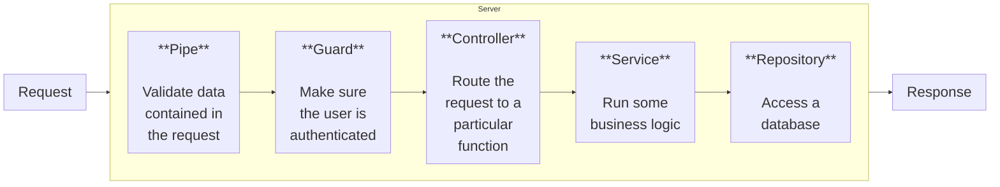

# NestJS Course

## Table of Content

1. [Nest from Scratch](#nest-from-scratch)
2. [With Nest CLI](#with-nest-cli)

---

## Nest from Scratch

### Initialize project and install dependencies

```bash
npm init -y
npm install @nestjs/common@7.6.17 @nestjs/core@7.6.17 @nestjs/platform-express@7.6.17 reflect-metadata@0.1.13 typescript@4.3.2
```

| Library                      | Description                                                                                           |
| ---------------------------- | ----------------------------------------------------------------------------------------------------- |
| **@nestjs/common**           | Contains vast majority of functions, classes, etc, that we need from Nest                             |
| **@nestjs/core**             | The core runtime of NestJS that powers dependency injection, module loading, and lifecycle management |
| **@nestjs/platform-express** | Lets Nest use Express JS for handling HTTP requests                                                   |
| **reflect-metadata**         | Helps make decorators work. Tons more on this in just a minute!                                       |
| **typescript**               | We write Nest apps with Typescript.                                                                   |

### Initialize typescript - (tsconfig.json)

```json
{
  "compilerOptions": {
    "module": "commonjs",
    "target": "es2017",
    "experimentalDecorators": true,
    "emitDecoratorMetadata": true
  }
}
```

| Setting                        | Description                                                                                                                                                      |
| ------------------------------ | ---------------------------------------------------------------------------------------------------------------------------------------------------------------- |
| "experimentalDecorators": true | Enables the use of decorators (@Something) in TypeScript. Without this, NestJS decorators (like @Controller()) would throw errors.                               |
| "emitDecoratorMetadata": true  | Works together with the reflect-metadata library. Emits extra type information about classes and methods at runtime, which NestJS uses for dependency injection. |

### Common pattern in server



### NestJS provides More

| Part             | Description                                                 |
| :--------------- | :---------------------------------------------------------- |
| **Pipes**        | Validates incoming data                                     |
| **Guards**       | Handles authentication                                      |
| **Controllers**  | Handles incoming requests                                   |
| **Services**     | Handles data access and business logic                      |
| **Repositories** | Handles data stored in a DB                                 |
| **Modules**      | Groups together code                                        |
| **Filters**      | Handles errors that occur during request handling           |
| **Interceptors** | Adds extra logic to incoming requests or outgoing responses |

### We need at least module and controller

### Create (`src/main.ts`)

```ts
import { Controller, Module, Get } from "@nestjs/common";
import { NestFactory } from "@nestjs/core";

@Controller()
class AppController {
  @Get()
  getRootRoute() {
    return "hi there!";
  }
}

@Module({
  controllers: [AppController],
})
class AppModule {}

async function bootstrap() {
  const app = await NestFactory.create(AppModule);
  await app.listen(3000);
}

bootstrap();
```

### Run

```bash
npx ts-node-dev src\main.ts
```

- Should give `Nest application successfully started`

### Check at `localhost:3000`

---

---

### Refactoring

## File Structure

- **main.ts**

  - `function bootstrap`

- **app.controller.ts**

  - `class AppController {}`

- **app.module.ts**
  - `class AppModule {}`

### Conventions

- One class per file (some exceptions)
- Class names should include the kind of thing we are creating
- Name of class and name of file should always match up
- Filename template: `name.type_of_thing.ts`

### Create `app.controller.ts`

```ts
import { Controller, Get } from "@nestjs/common";

@Controller()
export class AppController {
  @Get()
  getRootRoute() {
    return "hi there!";
  }
}
```

### Create `app.module.ts`

```ts
import { Module } from "@nestjs/common";
import { AppController } from "./app.controller";

@Module({
  controllers: [AppController],
})
export class AppModule {}
```

### Update `app.controller.ts`

```ts
import { NestFactory } from "@nestjs/core";
import { AppModule } from "./app.module";

async function bootstrap() {
  const app = await NestFactory.create(AppModule);

  await app.listen(3000);
}
bootstrap();
```

### Adding more Routes

### Update `app.controller.ts`

```ts
import { Controller, Get } from "@nestjs/common";

@Controller("/app")
export class AppController {
  @Get("/hi")
  getRootRoute() {
    return "hi there!";
  }

  @Get("/bye")
  getByeThere() {
    return "bye there!";
  }
}
```

---

---

---

## With Nest CLI

### Install nest cli

```bash
npm i -g @nestjs/cli
```

### Create nest project (message)

```bash
nest new project_name
```

### Run the project

```bash
npm run start:dev
```

### Delete everything in src folder except main

### Generate messages module

```bash
nest generate module messages
```

### Use message module in main (Remove app module)

```ts
import { NestFactory } from "@nestjs/core";
import { MessagesModule } from "./messages/messages.module";

async function bootstrap() {
  const app = await NestFactory.create(MessagesModule);
  await app.listen(3000);
}
bootstrap();
```

### Generate Controller inside messages folder

```bash
nest generate controller messages/messages --flat
```

- `--flat` says dont create folder called controllers

### Update src/messages/messages.controller.ts

```ts
import { Controller, Get, Post } from "@nestjs/common";

@Controller("messages")
export class MessagesController {
  @Get()
  listMessages() {}

  @Post()
  createMessage() {}

  @Get("/:id")
  getMessage() {}
}
```

> **Test using Postman or Thunder Client (vscode extension) for success status code**

### Access Body and Params

- Update src/messages/messages.controller.ts

```ts
import { Controller, Get, Post, Body, Param } from "@nestjs/common";

@Controller("messages")
export class MessagesController {
  @Get()
  listMessages() {}

  @Post()
  createMessage(@Body() body: any) {
    console.log(body);
  }

  @Get("/:id")
  getMessage(@Param("id") id: string) {
    console.log(id);
  }
}
```

> **Test for console log**

---

---

---
